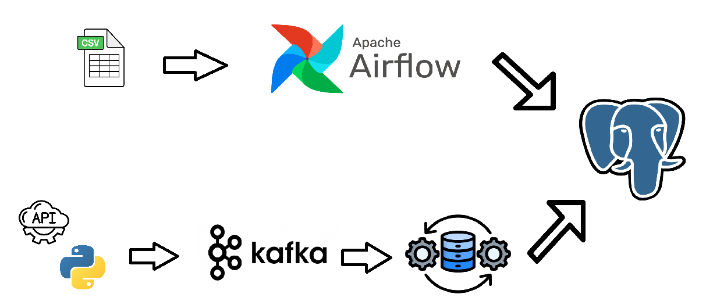

# Financial Data Pipeline

A complete data engineering pipeline for financial data, featuring batch processing with Apache Airflow, real-time streaming with Kafka, and centralized storage in PostgreSQL—all orchestrated with Docker Compose.

## Project Overview

This project demonstrates a complete data engineering pipeline that processes both batch and streaming financial data:

- **Batch Processing**: Historical stock prices and company fundamentals using Airflow DAGs
- **Streaming Processing**: Real-time stock ticks and trading orders using Kafka
- **Storage**: PostgreSQL database for both batch and streaming data
- **Infrastructure**: Docker Compose for easy deployment and management

## Architecture



## Components

- **PostgreSQL**: Central database for all data storage
- **Apache Airflow**: Orchestrates batch processing workflows
- **Apache Kafka**: Handles real-time data streams
- **Python**: Used for data processing and transformation

## Data Sources

- **Batch Sources**:
  - Historical stock price data (CSV)
  - Company fundamentals & analyst ratings (CSV)
  
- **Streaming Sources**:
  - Real-time stock price ticks
  - Trading orders/signals

## Getting Started

### Prerequisites

- Docker and Docker Compose
- Git

### Setup Instructions

1. Clone the repository:
```bash
git clone https://github.com/yourusername/financial-data-pipeline.git
cd financial-data-pipeline
```

2. Start the services:
```bash
docker-compose up -d
```

3. Generate sample data:
```bash
docker-compose exec airflow-webserver python /opt/airflow/dags/generate_sample_data.py
```

4. Access the Airflow UI:
   - Open http://localhost:8080 in your browser
   - Default credentials: airflow/airflow

## Project Structure

```
.
├── dags/                    # Airflow DAGs
│   └── historical_stock_processing.py
├── streaming/              # Streaming components
│   ├── consumer.py
│   ├── producer.py
│   ├── Dockerfile
│   └── requirements.txt
├── database/               # Database initialization
│   └── init.sql
├── docker-compose.yml      # Docker compose configuration
├── data_generator.py       # Sample data generator
└── README.md               # Project documentation
```

## License

This project is licensed under the MIT License - see the LICENSE file for details.

## Acknowledgments

- Yahoo Finance API for the inspiration for the data structure
- Apache Airflow documentation
- Confluent Kafka documentation